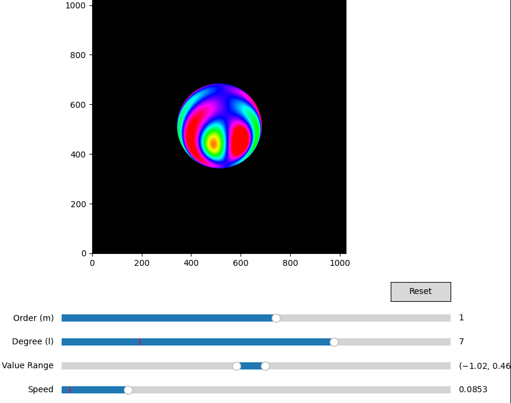

# Quick Start Guide

## Setup and Installation

To get started with the Spherical Harmonics Visualization project:

1. **Ensure you have the prerequisites**:
   - Python 3.12 or newer
   - CUDA-capable NVIDIA GPU (for optimal performance)

2. **Clone the repository** (if you haven't already):
   ```bash
   git clone https://github.com/yourusername/nvidia-warp-stuff.git
   cd nvidia-warp-stuff
   ```

3. **Create a virtual environment**:
   ```bash
   python -m venv venv
   ```

4. **Activate the environment**:
   - Linux/macOS: 
     ```bash
     source venv/bin/activate
     ```
   - Windows: 
     ```bash
     venv\Scripts\activate
     ```

5. **Install the dependencies**:
   ```bash
   pip install -r requirements.txt
   ```

6. **Initialize the environment** (if needed):
   ```bash
   ./init_py.sh
   ```

## Running the Visualization

1. **Activate environment variables** (if needed):
   ```bash
   source sourceme
   ```

2. **Run the main application**:
   ```bash
   python main.py
   ```

3. **For customized runs**, use command-line arguments:
   ```bash
   # Custom resolution
   python main.py --width 800 --height 800
   
   # Specify GPU device
   python main.py --device cuda:0
   
   # Run without UI (for rendering only)
   python main.py --headless
   ```

## Using the Interface



1. **Visualization Controls**:
   - **Click and drag** in the main visualization area to rotate the camera view
   - Watch how the spherical harmonic shapes change as you move around them

2. **Parameter Adjustments**:
   - **Degree (l) slider**: Controls the degree of the spherical harmonic (0-10)
   - **Order (m) slider**: Controls the order, which must satisfy -l ≤ m ≤ l
   - **Value Range slider**: Adjusts the color mapping range to highlight different intensity levels

3. **Reset Button**:
   - Click to restore the default parameter values

## Changing Environment Maps

To use a different environment map/skybox:

1. Add your new environment map (HDR, EXR, or standard image format) to the `img/` directory
2. Open `main.py` and modify the `SKYBOX_PATH` variable at the top:
   ```python
   SKYBOX_PATH = "img/your_new_image.exr"  # or .png, .jpg, etc.
   ```
3. Run the application again

## Next Steps

- Experiment with different degrees and orders to understand the shapes of various spherical harmonics
- Try different environment maps to see how spherical harmonic projection captures different lighting conditions
- Check the more detailed documentation in the `docs/` directory for implementation details and mathematical background

